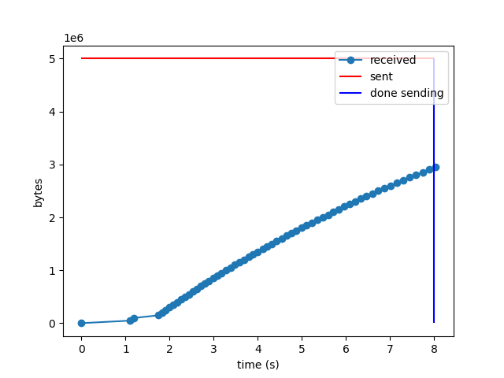
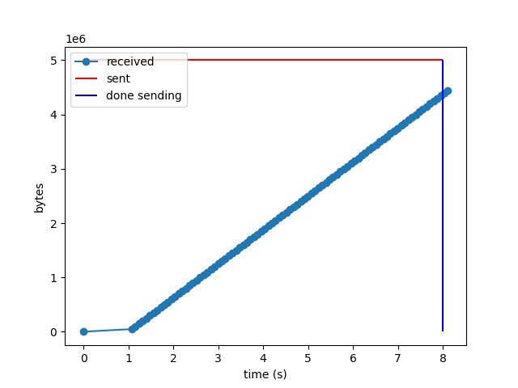

# SRv6 and INT using P4 and Mininet

## Dependencies

### Python Version

The code was tested using `Python 3.10.12`. If you wish to use a newer version, then you might need to remove the `set_switch_id` function calls in `mininet/set_flow_tables.py`

This is mainly because the code written using the older version (`0.0.5`) of `p4runtime_sh` is incompatible with the new versions.

An attempt was made at fixing this by including the package's source code in `mininet/p4runtime_sh_module/`. But it is highly recommended to install the required version.

### Packages

Run `sudo pip install -r requirements.txt` to install the required packages.

### Mininet

The code was written using version `2.3.0` of Mininet (both CLI and Python API).

## Repository structure

### `p4src/`

This contains the P4 source code as well as the intermediate output and the final JSON output (`main.json`), which is used to start the switch and a gRPC server on it. 

The `p4info.txt` file, along with `main.json`, is used by P4-Runtime to add table entries to P4 switches.

The script `compile.sh` compiles the P4 code in `main.p4`.

The `include/` sub-directory contains the implementation of some modules used by `main.p4`, such as the parser in `parser.p4`, as well as other data, such as the header definitions in `header.p4`.

### `tmp/`

This contains :

- log files (e.g. `bmv2-s1-log`) generated by the data plane of the routers.
- the "keep-alive" files (e.g. `bmv2-s1-watchdog.out`) that are used to keep the gRPC servers running on the switches. Removing these files will cause the servers to eventually be closed.
- the configuration of the switches obtained via NETCONF on runtime (e.g. `bmv2-s1-netcfg.json`)
- the output of the INT probe receiver (`received.txt`)

### `mininet/`

#### `bmv2_cleaned.py`

Since P4 switches are not supported by default by Mininet, we created custom classes to allow BMv2 (a P4 target/machine) switches to be simulated on Mininet.

#### `host6.py`

This is an abstraction of an IPv6-enabled host.

#### `interfaces.csv`

This CSV file contains information about the IP and MAC addresses associated with the interfaces on each communication link. Each line is of one of these two formats :

1. $(A,B,\text{IP}_A,\text{MAC}_A,\text{IP}_B,\text{MAC}_B,R,d)$ represents a communication link where 
   * $A,B$ are names of nodes in the Mininet topology
   * $R$ is the optional bandwidth in Mbps
   * $d$ is the optional delay (in $\mu\text{s}$)
   * $\text{MAC}_A,\text{IP}_A$ are the MAC and IP addresses on $A$'s interface for the communication link 
   * $\text{MAC}_B,\text{IP}_B$ are for $B$'s interface of the link
2. $(A,,\text{IP}_A,\text{MAC}_A,\text{IP}_B,,,)$ where $A$ is a host with IP address $\text{IP}_A$, MAC address $\text{MAC}_A$ and default gateway $\text{IP}_B$

This file is used at runtime to create the topology and run routing algorithms such as OSPF, following which, the table entries are computed for each P4 switch and it is programmed. 
Changing this file is akin to changing the topology. In essence, this CSV file is a programming interface.
The topology currently implemented is :


#### `flow.json`

This file is created just after the topology is created and can be used to set the table entries in the P4 switches. Initially (when created), it only contains entries that can forward to neighbourhood switches and hosts.

#### `ospf.py`

This script parses `flow.json` and uses `networkx` to run the shortest-path algorithm with each switch as source (and thus the OSPF) algorithm. Then, it updates the `flow.json` file. Using `flow.json` to program the switches now will give full connectivity.

#### `set_flow_tables.py`

This script uses the configuration JSON files in `tmp/` as well as `main.json` and `p4info.txt` from `p4src` to connect to the gRPC servers running on the routers via P4-Runtime. Then, it uses data from `flow.json` to set the appropriate table entries for each switch.

#### `sender.py`

This script uses `scapy` to craft packets with an INT header, SRv6 header and segment list and sends these packets on the given interface. Additionally, it uses functionality from `lookup_path.py` for ease of use.

#### `lookup_path.py`

This is a helper module that uses `interfaces.csv` to look up IP and MAC addresses for nodes in a path. For example :

```
~/SRV6_INT_P4/srv6int$ sudo python3 mininet/lookup_path.py h1 s1 --node
('2001:1:1::fa', '00:00:00:00:00:1a')
~/SRV6_INT_P4/srv6int$ sudo python3 mininet/lookup_path.py h1 s1,s2,h3
['2001:1:1::fa', '2001:1:a::fb', '2001:1:3::2']
```

#### `receiver.py`

This file creates a server process listening on all interfaces. It parses the INT probes that are received, prints the contents in `tmp/received.txt` and sends back a datagram to the client.

#### `mininet_script.txt`

Mininet allows for running scripts. This is one such script. It handles running the routing algorithm, setting the table entries, setting up the INT server and sending INT probes automatically.

#### `topo.py`

This is the entry point. This program creates the Mininet topology and runs the `mininet_script.txt` script. Additionally, it opens the CLI after that if `--cli` is passed in as an argument and skips running the Mininet script if `--only_cli` is passed. 

This also creates a visualisation for the topology using `graphviz`. The `dot` code is stored in `topo` (no extension), and the image is written to `topo.png`.


#### `topologies/`

This subdirectory contains more files like `interfaces.csv`, each implementing a different topology. To use these topologies, simply copy the contents to `interfaces.csv`. For example:

```
cp topologies/interfaces_M.csv interfaces.csv
```

#### `server.py`

This starts an active INT server similar to one described in the SFANT system.
This server first crafts an empty INT probe that is routed using SRv6 to go through some desired path and come back, and then periodically sends it in intervals of 10 ms.

For example, on running `h3 python3 mininet/server.py h3-eth0 h3,s1,s2,h3 01111`, you will get a deluge of logs of this kind : 

```
Probe packet sent on interface h3-eth0
Probe packet sent on interface h3-eth0
Received packet with ethertype ffff on h3-eth1
Probe packet sent on interface h3-eth0
Received packet with ethertype ffff on h3-eth1
Received packet with ethertype ffff on h3-eth1
Probe packet sent on interface h3-eth0
Received packet with ethertype ffff on h3-eth1
```

And there will be a file called `parsed_probes.txt` that will contain the bytes for the SRv6 segment list (hex) and the telemetry data that the filled probes came with.

## Example Execution

### Compiling

```
~/SRV6_INT_P4/srv6int$ cd p4src
~/SRV6_INT_P4/srv6int/p4src$ ./compile.sh 
```

### Creating Topology

First, clean the past instance of Mininet using:

```sh
sudo mn -c 1>/dev/null 2>/dev/null
```

Then, run the `topo.py` program as:

```sh
sudo python3 mininet/topo.py --only_cli
```

The output will be

```
~/SRV6_INT_P4/srv6int$ sudo mn -c 1>/dev/null 2>/dev/null
~/SRV6_INT_P4/srv6int$ sudo python3 mininet/topo.py --only_cli

Host config
h1 : ['2001:1:1::1/64', '00:00:00:00:00:10', '2001:1:1::fa']
h2 : ['2001:1:2::2/64', '00:00:00:00:00:21', '2001:1:2::fb']
h3 : ['2001:1:3::1/64', '00:00:00:00:00:30', '2001:1:3::fa']

Addresses
        s1
                2001:1:1::fa/128,00:00:00:00:00:1a
                2001:1:3::fa/128,00:00:00:00:00:3a
                2001:1:b::fa/128,00:00:00:00:00:ba
        h1
                2001:1:1::1/128,00:00:00:00:00:10
        h3
                2001:1:3::1/128,00:00:00:00:00:30
                2001:1:3::2/128,00:00:00:00:00:31
        s2
                2001:1:2::fb/128,00:00:00:00:00:2b
                2001:1:3::fb/128,00:00:00:00:00:3b
                2001:1:a::fb/128,00:00:00:00:00:ab
        h2
                2001:1:2::2/128,00:00:00:00:00:21
Unable to contact the remote controller at 10.0.0.1:6653
Unable to contact the remote controller at 10.0.0.1:6633
Setting the remote controller to 10.0.0.1:6653
...⚡️ simple_switch_grpc @ 1514977
..⚡️ simple_switch_grpc @ 1514996
mininet> 
```

This will also create the `flow.json` file.

### Routing algorithm and table entries

Run the shortest path algorithm using

```
c0 python3 mininet/ospf.py
```

Then set the flow tables as 

```
c0 python3 mininet/set_flow_tables.py
```

The output of the second command is large. A truncated version is shown here.

```
mininet> c0 python3 mininet/ospf.py
mininet> c0 python3 mininet/set_flow_tables.py
. . .
field_id: 1
lpm {
  value: " \001\000\001\000\003\000\000\000\000\000\000\000\000\000\001"
  prefix_len: 128
}

param_id: 1
value: "0"

Routing_v6 entry added: 2001:1:3::1/128 -> next hop 00:00:00:00:00:30
. . .
s1 :
('add_routing_v6_entry', '2001:1:3::1/128', '00:00:00:00:00:30')
('add_unicast_entry', '00:00:00:00:00:ab', '3')
('add_srv6_localsid_entry', '2001:1:1::fa/128', 'srv6_end', None, None, None, None)
('add_routing_v6_entry', '2001:1:3::2/128', '00:00:00:00:00:30')
. . .
('add_routing_v6_entry', '2001:1:1::1/128', '00:00:00:00:00:10')
. . .
s2 :
('add_routing_v6_entry', '2001:1:2::2/128', '00:00:00:00:00:21')
. . .
('add_unicast_entry', '00:00:00:00:00:21', '1')
```

Now, there is full connectivity. This can be verified using `ping6`

```
mininet> h1 ping6 h2
PING 2001:1:2::2(2001:1:2::2) 56 data bytes
64 bytes from 2001:1:2::2: icmp_seq=1 ttl=62 time=4.42 ms
64 bytes from 2001:1:2::2: icmp_seq=2 ttl=62 time=3.43 ms
64 bytes from 2001:1:2::2: icmp_seq=3 ttl=62 time=4.37 ms
64 bytes from 2001:1:2::2: icmp_seq=4 ttl=62 time=5.30 ms
64 bytes from 2001:1:2::2: icmp_seq=5 ttl=62 time=2.79 ms
^C
--- 2001:1:2::2 ping statistics ---
5 packets transmitted, 5 received, 0% packet loss, time 4006ms
rtt min/avg/max/mdev = 2.791/4.062/5.303/0.868 ms
```

### Receiver and Sender

You can set a receiver process on `h3` so that it will parse INT probes as :

```
h3 python3 mininet/receiver.py &
```

Then, `h1` can send SRv6 enabled INT probes with `h3` as the final destination as

```
h1 python3 mininet/sender.py h1-eth0 h1,s1,h3 01111
```

or as 

```
h1 python3 mininet/sender.py h1-eth0 00:00:00:00:00:10 2001:1:1::1 00:00:00:00:00:20 2001:1:1::fa 2001:1:3::2,2001:1:a::fb
```

On executing, we get this output :

```
mininet> h3 python3 mininet/receiver.py &
mininet> h1 python3 mininet/sender.py h1-eth0 h1,s1,h3 01111
Packet Information
        src MAC : 00:00:00:00:00:10
        src IP : 2001:1:1::1
        dst MAC : 00:00:00:00:00:1a
        dst IP : 2001:1:1::fa
        srv6 SIDs : ['2001:1:3::1']
Crafted probe!
Waiting for INT results on [2001:1:1::1]:9999...
[Listener] Raw packet of length 131 bytes received on h1-eth0!
Skipping packet - wrong destination port (expected 9999, got 5353)
[Listener] Raw packet of length 70 bytes received on h1-eth0!
Skipping non-UDP packet (next header: 58)
Sending packet...
Probe packet sent on interface h1-eth0
Waiting for response (timeout: 30 seconds)...
[Listener] Raw packet of length 140 bytes received on h1-eth0!
--- Received Telemetry Results ---
Payload length: 78 bytes
Parsed Hop Data:
  [Hop 1]
    inPortID : 1
    ePortID : 2
    inTimeStamp : 4337879
    eTimeStamp : 4345853
------------------------------------
----------sender.py finished----------
```

The `tmp/received.txt` file will now have something like this :

```
Received INT probe: 00000000003000000000001affff4017800001020000004230d7000000424ffd6000000000182b3f20010001000100000000000000000001200100010003000000000000000000013b0204000000000020010001000300000000000000000001
	 dst_MAC : 000000000030
	 src_MAC : 00000000001a
	 ethertype : ffff
	 inth : 40178000
	 n : 1
	 bitmap : 01111000000000000000
	 metadata bits : 112
	 meta_list : 01020000004230d7000000424ffd
	 IPv6fields : 6000000000182b3f
	 src_IP_hex : 20010001000100000000000000000001
	 dst_IP_hex : 20010001000300000000000000000001
	 srv6 : 3b0204000000000020010001000300000000000000000001
	Parsed meta list:
	 {'inPortID': 1, 'ePortID': 2, 'inTimeStamp': 4337879, 'eTimeStamp': 4345853}
```

To have the INT probe visit both `s1` and `s2`, we can use :

```
h1 python3 mininet/sender.py h1-eth0 h1,s1,s2,h3 01111
```

For example

```
mininet> h3 python3 mininet/receiver.py &
mininet> h1 python3 mininet/sender.py h1-eth0 h1,s1,s2,h3 01111
Packet Information
        src MAC : 00:00:00:00:00:10
        src IP : 2001:1:1::1
        dst MAC : 00:00:00:00:00:1a
        dst IP : 2001:1:1::fa
        srv6 SIDs : ['2001:1:3::2', '2001:1:a::fb']
Crafted probe!
Waiting for INT results on [2001:1:1::1]:9999...
[Listener] Raw packet of length 70 bytes received on h1-eth0!
Skipping non-UDP packet (next header: 58)
Sending packet...
Probe packet sent on interface h1-eth0
Waiting for response (timeout: 30 seconds)...
[Listener] Raw packet of length 218 bytes received on h1-eth0!
--- Received Telemetry Results ---
Payload length: 156 bytes
Parsed Hop Data:
  [Hop 1]
    inPortID : 1
    ePortID : 3
    inTimeStamp : 4817767
    eTimeStamp : 4820521
  [Hop 2]
    inPortID : 3
    ePortID : 2
    inTimeStamp : 4435464
    eTimeStamp : 4440049
------------------------------------
----------sender.py finished----------
mininet> exit
```

This now gives two sets of metadata entries in the filled probe.

```
Received INT probe: 0000000000310000000000abffff402780000103000000498367000000498e29030200000043ae0800000043bff16000000000282b3e20010001000100000000000000000001200100010003000000000000000000023b040400010000002001000100030000000000000000000220010001000a000000000000000000fb
	 dst_MAC : 000000000031
	 src_MAC : 0000000000ab
	 ethertype : ffff
	 inth : 40278000
	 n : 2
	 bitmap : 01111000000000000000
	 metadata bits : 112
	 meta_list : 0103000000498367000000498e29030200000043ae0800000043bff1
	 IPv6fields : 6000000000282b3e
	 src_IP_hex : 20010001000100000000000000000001
	 dst_IP_hex : 20010001000300000000000000000002
	 srv6 : 3b040400010000002001000100030000000000000000000220010001000a000000000000000000fb
	Parsed meta list:
	 {'inPortID': 1, 'ePortID': 3, 'inTimeStamp': 4817767, 'eTimeStamp': 4820521}
	 {'inPortID': 3, 'ePortID': 2, 'inTimeStamp': 4435464, 'eTimeStamp': 4440049}
```

## Quality of real-time measurement

The main incentive to use INT is that it can continuously measure in real-time with no overhead on the telemetry application and routing processor caused due to a management plane protocol such as SNMP. 
To get a measure of how "real-time" these measurements are, we can run the `server.py` script with the `--time` option. 


Without the `--time` option, it starts an active INT server, similar to the SFANT system. With the option, it additionally times this process at 2 stages: the probe end-to-end delay, and the processing time (for parsing the probe). The time for crafting the probe is not included since that is done only once when a telemetry request arrives; after that the same packet is re-sent periodically.
We can run the script like this : 

```
mininet> h3 python3 mininet/server.py h3-eth0 h3,s1,s2,h3 001 --time
Probe end-to-end delay: mean= 0.0003527455806732178 , std= 6.717807232196294e-05
Processing delay: mean= 2.0142173767089843e-05 , std= 6.091096330625261e-06
Packets arrived back: 5000 / 5000 = 100 %
saved to mininet/INT_delay.png
```

The values in the output are in seconds. Thus, the mean "routing delay" is around 0.35 ms. This is the time elapsed from when a packet is sent to when it is received back. 
The script also created this histogram:


Compared to this, the interval at which telemetry data is polled in a traditional SNMP-based Network Telemetry system is in seconds to half a minute.

## Overhead due to INT

Since packets containing INT headers are processed for longer in the switches, they cause queuing delay for other packets. We want to know how severe this may be. To do that, I have created scripts `flood_sender.py` and `flood_receiver.py` that send and receive 5 MB of data (including headers) over UDP. 


The `flood_sender.py` script takes in the interface, source host, destination host, average rate $r$ in Mbps, packet size $L$ in bytes, burst length $n$, and total amount of data to send in MB. For the given topology, an appropriate pair of source host and destination host is "h1" and "h2" and an appropriate amount of data to send is 5 MB.
For example, `h1 python3 mininet/flood_sender.py h1-eth0 "h1" "h2" 4 500 5 5`. It also writes the time at which it started sending data to `tmp/flood_start.txt` and the time when it finished as well as bytes sent to `tmp/flood_end.txt` . 
The `flood_receiver.py` script on the other hand periodically writes the number of packets to `tmp/receiver_status.txt` .
Using all of this data, `analysis.py` creates plots like these :


This one was created using $r=1,\, L =500,\, n = 1$ .

Here are some more with varying values of $r$, keeping other parameters constant and contrasting them with the case INT probes are being sent but no metadata is requested.

<table>
<tr>
<td> r (Mbps) </td> <td> No INT </td> <td> INT but bitmap = 0 </td>
</tr>

<tr><td>1</td><td></td><td></td></tr>
<tr><td>2</td><td></td><td></td></tr>
<tr><td>4</td><td></td><td></td></tr>
<tr><td>5</td><td></td><td></td></tr>
</table>

For the second case, the probes are being sent from `h3` which using the `server.py` script with `--time` option. These probes are sent at an interval of 100 ms.


As you can see from the images, with an increase in $r$, the packets lost  (the gap between the orange horizontal line and the last reading for packets received) increases.
Moreover, the case where INT probes are also being sent is almost identical.

Thus, we can conclude that there is minimal overhead due to the extra INT probes.

Now, we move on to the case where we are requesting only the egress port values. The egress port value is stored as a 8 bit value in the metadata list.
We will compare this with the case where there are no INT probes being sent.
For both, we will use $r=5$, $n=1$ and $L=500$ .

<table>
<tr>
<td>Requesting Egress Port</td>
<td>No INT</td>
</tr>
<tr>
<td></td>
<td></td>
</tr>
</table>

As you can see, there is a significant change. This is because the processing time for the probes has suddenly become much worse than before. 
This substantially increases the queue length and causes packet loss. 

The reason for this sudden increase is this line in `main.p4`:

```C++
hdr.ePortID.value = (bit<8>)(standard_metadata.egress_spec);
```

In particular, accessing `standard_metadata.egress_spec`, which is the standard way to get metadata is handled using C++ data structures rather than native pipeline fields.
This is a general problem with the behavioural model (`BMv2`), since it is interpreted, rather than compiled.
To remedy this, one can move to `tofino-model` which _is_ compiled.
But even using `tofino-model` we will not get the real delay, since it is only compiled and not burnt into hardware.
Using only software, it is impossible to get the actual delays that one would see in a real programmable switch.

Thus, we cannot proceed with the overhead computation by measurement alone.
Instead, we need to use the values observed on hardware for different computations done and predict the delay.

Usually, these computations are done under one micro-second [[1](https://www.intel.com/content/www/us/en/products/network-io/programmable-ethernet-switch/tofino-series.html)], and thus cause negligible delays as compared to the transmission delay of at least $1\, \mu\text{s}$ with packet size of 500 bytes and a 4 Gbps transmission rate.

## References

[1] Barefoot Networks. *Tofino: World’s Fastest P4-Programmable Ethernet Switch ASICs.* Intel Corporation, 2020. [Link](https://www.intel.com/content/www/us/en/products/network-io/programmable-ethernet-switch/tofino-series.html)
