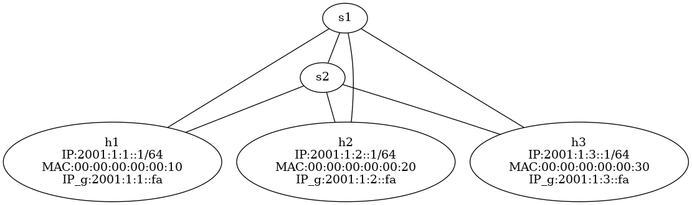

# SRv6 and INT using P4 and Mininet

## Dependencies

### Python version

The code was tested using `Python 3.10.12`. If you wish to use a newer version, then you might need to remove the `set_switch_id` function calls in `mininet/set_flow_tables.py`

This is mainly because the code written using the older version (`0.0.5`) of `p4runtime_sh` is incompatible with the new versions.

An attempt was made at fixing this by including the package's source code in `mininet/p4runtime_sh_module/`. But, it is highly recommended to install the required version.

### Packages

Simply run `sudo pip install -r requirements.txt` to install latest packages.

### Mininet

The code was written using version `2.3.0` of Mininet (both CLI and Python API).

## Repository structure

### `p4src/`

This contains the P4 source code as well as the the intermediate output and the final JSON output (`main.json`) which is used to start the switch and a gRPC server on it. 

The `p4info.txt` file, along with `main.json` is used by P4-Runtime to add table entries to P4 switches.

The script `compile.sh` compiles the P4 code in `main.p4` .

The `include/` sub-directory contains the implementation of some modules used by `main.p4` such as the parser in `parser.p4`, as well as other data such as the header definitions in `header.p4`.

### `tmp/`

This contains :

- log files (e.g. `bmv2-s1-log`) generated by the data plane of the routers.
- the "keep-alive" files (e.g. `bmv2-s1-watchdog.out`) that are used to keep the gRPC servers running on the switches. Removing these files with cause the servers to be eventually closed.
- the configuration of the switches obtained via NETCONF on runtime (e.g. `bmv2-s1-netcfg.json`)
- the output of the INT probe receiver (`received.txt`)

### `mininet/`

#### `bmv2_clearned.py`

Since P4 switches are not supported by default by Mininet, we created custom classes to allow BMv2 (a P4 target/machine) switches to be simulated on Mininet.

#### `host6.py`

This is an abstraction of an IPv6 enabled host.

#### `interfaces.csv`

This CSV file contains information about the IP and MAC addresses associated with the interfaces on each communication link.

1. $(A,B,\text{IP}_A,\text{MAC}_A,\text{IP}_B,\text{MAC}_B)$ where $A,B$ are names of nodes in the Mininet topology, $\text{MAC}_A,\text{IP}_A$ are the MAC and IP addresses on $A$'s interfaces for the communication link and $\text{MAC}_B,\text{IP}_B$ are for $B$

2. $(A,\_,\text{IP}_A,\text{MAC}_A,\text{IP}_B,\_)$ where $A$ is a host with IP address $\text{IP}_A$, MAC address $\text{MAC}_A$ and default gateway $\text{IP}_B$

This file is used in run-time to create the topology and to run routing algorithms such as OSPF, following which, the table entries are computed for each P4 switch and it is programmed. 
Changing this file is akin to changing the topology. In essense, this CSV file is a programming interface.
The topology currently implemented is :

{height=200px}

#### `flow.json`

This file is created just after the topology is created and can be used to set the table entries in the P4 switches. Initially (when created), it only contains entries that can forward to neighourhood switches and hosts.

#### `ospf.py`

This script parses `flow.json` and uses `networkx` to run the shortest-path algorithm with each switch as source (and thus the OSPF) algorithm. Then, it updates the `flow.json` file. Using `flow.json` to program the switches now will give full connectivity.

#### `set_flow_tables.py`

This script uses the configuration JSON files in `tmp/` as well as `main.json` and `p4info.txt` from `p4src` to connect to the gRPC servers running on the routers via P4-Runtime. Then, it uses data from `flow.json` to set the appropriate table entries for each switch.

#### `sender.py`

This script uses `scapy` to craft packets with INT header, SRv6 header and segment list and sends these packets on the given interface. Additionally, it uses functionality from `lookup_path.py` for ease of use.

#### `lookup_path.py`

This is a helper module that uses `interfaces.csv` to look up IP and MAC addresses for nodes in a path. For example :

```
~/SRV6_INT_P4/srv6int$ sudo python3 mininet/lookup_path.py h1 s1 --node
('2001:1:1::fa', '00:00:00:00:00:1a')
~/SRV6_INT_P4/srv6int$ sudo python3 mininet/lookup_path.py h1 s1,s2,h3
['2001:1:1::fa', '2001:1:a::fb', '2001:1:3::2']
```

#### `receiver.py`

This file creates a server process listening on all interfaces. It parses the INT probes that are received, prints the contents in `tmp/received.txt` and sends back a datagram to the client.

#### `mininet_script.txt`

Mininet allows for running scripts. This is one such script. It handles running the routing algorithm, setting the tables entries, setting up the INT server and sending INT probes automatically.

#### `topo.py`

This is the entry point. This program creates the Mininet topology and runs the `mininet_script.txt` script. Additionaly, it opens the CLI after that if `--cli` is passed in as an argument and skips running the Mininet script if `--only_cli` is passed. 

This also creates a visualisation for the topology using `graphviz`. The `dot` code is stored in `topo` (no extension) and the image is written to `topo.png`.

## Example Execution

### Compiling

```
~/SRV6_INT_P4/srv6int$ cd p4src
~/SRV6_INT_P4/srv6int/p4src$ ./compile.sh 
```

### Creating Topology

First clean the past instance of Mininet using:

```sh
sudo mn -c 1>/dev/null 2>/dev/null
```

Then, run the `topo.py` program as:

```sh
sudo python3 mininet/topo.py --only_cli
```

The putput will be

```
~/SRV6_INT_P4/srv6int$ sudo mn -c 1>/dev/null 2>/dev/null
~/SRV6_INT_P4/srv6int$ sudo python3 mininet/topo.py --only_cli

Host config
h1 : ['2001:1:1::1/64', '00:00:00:00:00:10', '2001:1:1::fa']
h2 : ['2001:1:2::2/64', '00:00:00:00:00:21', '2001:1:2::fb']
h3 : ['2001:1:3::1/64', '00:00:00:00:00:30', '2001:1:3::fa']

Addresses
        s1
                2001:1:1::fa/128,00:00:00:00:00:1a
                2001:1:3::fa/128,00:00:00:00:00:3a
                2001:1:b::fa/128,00:00:00:00:00:ba
        h1
                2001:1:1::1/128,00:00:00:00:00:10
        h3
                2001:1:3::1/128,00:00:00:00:00:30
                2001:1:3::2/128,00:00:00:00:00:31
        s2
                2001:1:2::fb/128,00:00:00:00:00:2b
                2001:1:3::fb/128,00:00:00:00:00:3b
                2001:1:a::fb/128,00:00:00:00:00:ab
        h2
                2001:1:2::2/128,00:00:00:00:00:21
Unable to contact the remote controller at 10.0.0.1:6653
Unable to contact the remote controller at 10.0.0.1:6633
Setting remote controller to 10.0.0.1:6653
...⚡️ simple_switch_grpc @ 1514977
..⚡️ simple_switch_grpc @ 1514996
mininet> 
```

This will also create the `flow.json` file.

### Routing algorithm and table entries

Run the shortest path algorithm using

```
c0 python3 mininet/ospf.py
```

Then set the flow tables as 

```
c0 python3 mininet/set_flow_tables.py
```

The output of the second command is large. A truncated version is shown here.

```
mininet> c0 python3 mininet/ospf.py
mininet> c0 python3 mininet/set_flow_tables.py
. . .
field_id: 1
lpm {
  value: " \001\000\001\000\003\000\000\000\000\000\000\000\000\000\001"
  prefix_len: 128
}

param_id: 1
value: "0"

Routing_v6 entry added: 2001:1:3::1/128 -> next hop 00:00:00:00:00:30
. . .
s1 :
('add_routing_v6_entry', '2001:1:3::1/128', '00:00:00:00:00:30')
('add_unicast_entry', '00:00:00:00:00:ab', '3')
('add_srv6_localsid_entry', '2001:1:1::fa/128', 'srv6_end', None, None, None, None)
('add_routing_v6_entry', '2001:1:3::2/128', '00:00:00:00:00:30')
. . .
('add_routing_v6_entry', '2001:1:1::1/128', '00:00:00:00:00:10')
. . .
s2 :
('add_routing_v6_entry', '2001:1:2::2/128', '00:00:00:00:00:21')
. . .
('add_unicast_entry', '00:00:00:00:00:21', '1')
```

Now, there is full connectivity. This can be verified using `ping6`

```
mininet> h1 ping6 h2
PING 2001:1:2::2(2001:1:2::2) 56 data bytes
64 bytes from 2001:1:2::2: icmp_seq=1 ttl=62 time=4.42 ms
64 bytes from 2001:1:2::2: icmp_seq=2 ttl=62 time=3.43 ms
64 bytes from 2001:1:2::2: icmp_seq=3 ttl=62 time=4.37 ms
64 bytes from 2001:1:2::2: icmp_seq=4 ttl=62 time=5.30 ms
64 bytes from 2001:1:2::2: icmp_seq=5 ttl=62 time=2.79 ms
^C
--- 2001:1:2::2 ping statistics ---
5 packets transmitted, 5 received, 0% packet loss, time 4006ms
rtt min/avg/max/mdev = 2.791/4.062/5.303/0.868 ms
```

### Server and client

You can set a receiver process on `h3` so that it will parse INT probes as :

```
h3 python3 mininet/reciever.py &
```

Then, `h1` can send SRv6 enabled INT probles with `h3` as the final destination as

```
h1 python3 mininet/sender.py h1-eth0 h1,s1,h3 01111
```

or as 

```
h1 python3 mininet/sender.py h1-eth0 00:00:00:00:00:10 2001:1:1::1 00:00:00:00:00:20 2001:1:1::fa 2001:1:3::2,2001:1:a::fb
```

On executing, we get this output :

```
mininet> h3 python3 mininet/reciever.py &
mininet> h1 python3 mininet/sender.py h1-eth0 h1,s1,h3 01111
Packet Information
        src MAC : 00:00:00:00:00:10
        src IP : 2001:1:1::1
        dst MAC : 00:00:00:00:00:1a
        dst IP : 2001:1:1::fa
        srv6 SIDs : ['2001:1:3::1']
Crafted probe!
Waiting for INT results on [2001:1:1::1]:9999...
[Listener] Raw packet of length 131 bytes received on h1-eth0!
Skipping packet - wrong destination port (expected 9999, got 5353)
[Listener] Raw packet of length 70 bytes received on h1-eth0!
Skipping non-UDP packet (next header: 58)
Sending packet...
Probe packet sent on interface h1-eth0
Waiting for response (timeout: 30 seconds)...
[Listener] Raw packet of length 140 bytes received on h1-eth0!
--- Received Telemetry Results ---
Payload length: 78 bytes
Parsed Hop Data:
  [Hop 1]
    inPortID : 1
    ePortID : 2
    inTimeStamp : 4337879
    eTimeStamp : 4345853
------------------------------------
----------sender.py finished----------
```

The `tmp/received.txt` file will now have something like this :

```
Received INT probe: 00000000003000000000001affff4017800001020000004230d7000000424ffd6000000000182b3f20010001000100000000000000000001200100010003000000000000000000013b0204000000000020010001000300000000000000000001
	 dst_MAC : 000000000030
	 src_MAC : 00000000001a
	 ethertype : ffff
	 inth : 40178000
	 n : 1
	 bitmap : 01111000000000000000
	 metadata bits : 112
	 meta_list : 01020000004230d7000000424ffd
	 IPv6fields : 6000000000182b3f
	 src_IP_hex : 20010001000100000000000000000001
	 dst_IP_hex : 20010001000300000000000000000001
	 srv6 : 3b0204000000000020010001000300000000000000000001
	Parsed meta list:
	 {'inPortID': 1, 'ePortID': 2, 'inTimeStamp': 4337879, 'eTimeStamp': 4345853}
```

To have the INT probe visit both `s1` and `s2`, we can use :

```
h1 python3 mininet/sender_srv6.py h1-eth0 h1,s1,s2,h3 01111
```

For example

```
mininet> h3 python3 mininet/reciever.py &
mininet> h1 python3 mininet/sender_srv6.py h1-eth0 h1,s1,s2,h3 01111
Packet Information
        src MAC : 00:00:00:00:00:10
        src IP : 2001:1:1::1
        dst MAC : 00:00:00:00:00:1a
        dst IP : 2001:1:1::fa
        srv6 SIDs : ['2001:1:3::2', '2001:1:a::fb']
Crafted probe!
Waiting for INT results on [2001:1:1::1]:9999...
[Listener] Raw packet of length 70 bytes received on h1-eth0!
Skipping non-UDP packet (next header: 58)
Sending packet...
Probe packet sent on interface h1-eth0
Waiting for response (timeout: 30 seconds)...
[Listener] Raw packet of length 218 bytes received on h1-eth0!
--- Received Telemetry Results ---
Payload length: 156 bytes
Parsed Hop Data:
  [Hop 1]
    inPortID : 1
    ePortID : 3
    inTimeStamp : 4817767
    eTimeStamp : 4820521
  [Hop 2]
    inPortID : 3
    ePortID : 2
    inTimeStamp : 4435464
    eTimeStamp : 4440049
------------------------------------
----------sender.py finished----------
mininet> exit
```

This now gives two sets of metadata entries in the filled probe.

```
Received INT probe: 0000000000310000000000abffff402780000103000000498367000000498e29030200000043ae0800000043bff16000000000282b3e20010001000100000000000000000001200100010003000000000000000000023b040400010000002001000100030000000000000000000220010001000a000000000000000000fb
	 dst_MAC : 000000000031
	 src_MAC : 0000000000ab
	 ethertype : ffff
	 inth : 40278000
	 n : 2
	 bitmap : 01111000000000000000
	 metadata bits : 112
	 meta_list : 0103000000498367000000498e29030200000043ae0800000043bff1
	 IPv6fields : 6000000000282b3e
	 src_IP_hex : 20010001000100000000000000000001
	 dst_IP_hex : 20010001000300000000000000000002
	 srv6 : 3b040400010000002001000100030000000000000000000220010001000a000000000000000000fb
	Parsed meta list:
	 {'inPortID': 1, 'ePortID': 3, 'inTimeStamp': 4817767, 'eTimeStamp': 4820521}
	 {'inPortID': 3, 'ePortID': 2, 'inTimeStamp': 4435464, 'eTimeStamp': 4440049}
```
